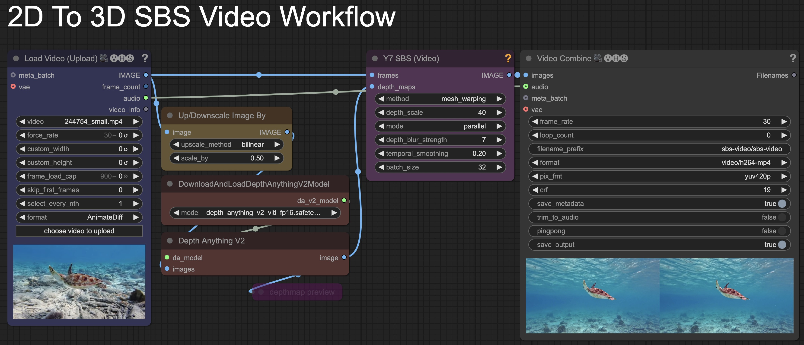
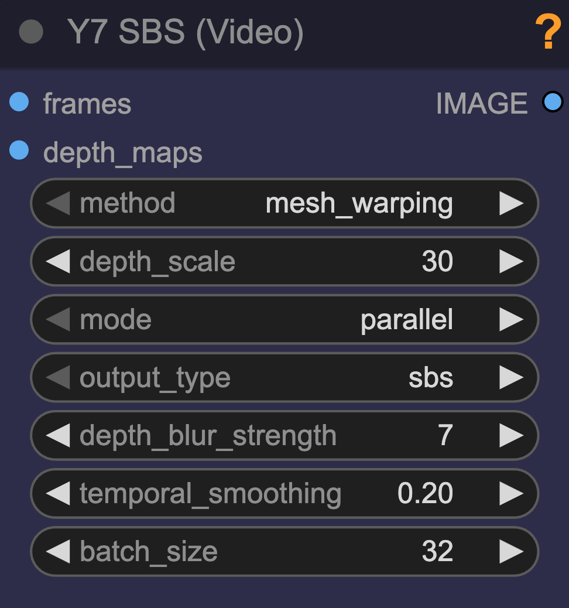

# ComfyUI-Y7-SBS-2Dto3D

Two custom ComfyUI nodes that convert 2D images or videos into a simulated 3D side-by-side (SBS) format, viewable on compatible devices such as VR/AR headsets like Meta Quest, Apple Vision Pro, HTC Vive, or even those crappy cardboard ones.




## Installation (ComfyUI Manager)

 #### This is the better way to install: 
 - Open `ComfyUI Manager` 
   - → `Custom Nodes Manager` 
   - → Search for `Y7` or `Y7 SBS`. 
   - Install. 
   - Restart Restart ComfyUI

------

## Installation (Manual)

1. Clone this repository into your ComfyUI custom_nodes directory:
   ```bash
   cd /path/to/ComfyUI/custom_nodes
   git clone https://github.com/yushan777/ComfyUI-Y7-SBS-2Dto3D comfyui-y7-sbs-2dto3d
   
   ```

2. Install Dependencies
   ```bash
   # activate your venv (if you have one)
   # Linux/macOS
   source venv/bin/activate
   or 
   # Windows
   venv/Scripts/activate
   
   pip install -r requirements.txt   
   ```

3. Restart ComfyUI if it's already running.

------

## Nodes

### Y7 SBS (Image)
> Takes a single image as input, and its associated depth map and will produce an SBS formatted stereoscopic 3D image.
>
> 
> <details>
>   <summary>ℹ️ <i>See More Information</i></summary>
>
>   <strong>Inputs/Widgets</strong>
>
>   - **base_image**: The image you wish to convert to 3D 
>   - **depth_map**: The depth map of the base image
>   - **method**: Select the 3D rendering method:
>     - **mesh_warping**: 
>     - **grid_sampling**: 
>   - **depth_scale**: Controls the strength of the 3D effect (default: 30). Higher values create more pronounced depth but at the cost of tearing and artefacts
>   - **mode**: 
>     - Parallel: For parallel viewing (left eye sees left image, right sees right image)
>     - Cross-eyed: For cross-eyed viewing (left eye sees right image and vice versa) - useful to check the effect if you do not have a 3D device.
>   - **depth_blur_strength**: Controls how much to blur the depth map transitions (3-33, odd values only). 
>     - Lower values for sharper depth separation between objects or layers.
>     - Higher values for smoother transitions between depth planes, though this may introduce some distortion in some images.
> </details>


### Y7 SBS (Video)
> Takes a video's frames as input, and their associated depth maps and and will produce an SBS formatted stereoscopic 3D video.
>
> 
> <details>
>   <summary>ℹ️ <i>See More Information</i></summary>
>
>   <strong>Inputs/Widgets</strong>
>
>   - **frames**: The frames of the video you wish to convert to 3D 
>   - **depth_maps**: The depth maps of video frames 
>   - **method**: Select the 3D rendering method:
>     - **mesh_warping**: 
>     - **grid_sampling**: 
>   - **depth_scale**: Controls the strength of the 3D effect (default: 30). Higher values create more pronounced depth but at the cost of tearing and artefacts
>   - **mode**: 
>     - Parallel: For parallel viewing (left eye sees left image, right sees right image)
>     - Cross-eyed: For cross-eyed viewing (left eye sees right image and vice versa) - useful to check the effect if you do not have a 3D device.
>   - **depth_blur_strength**: Controls how much to blur the depth map transitions (3-33, odd values only). 
>     - Lower values for sharper depth separation between objects or layers.
>     - Higher values for smoother transitions between depth planes, though this may introduce some distortion in some images.
>   - **temporal_smoothing**: Controls smoothing between frames (0.0-0.5). Higher values create more consistent depth perception between frames but may reduce responsiveness to rapid depth changes.
>   - **batch_size**: Number of video frames to process at once. higher = more memory usage.
> </details>

### About Cross-eyed Mode
>  - Cross-eyed mode is primarily used for viewing stereoscopic 3D images on a regular 2D screen without needing any special equipment. Here's how it is used:
>  - With Parallel, the left-eye image feeds the left eye, and the right-eye image feeds the right eye. 
>  - But with Cross-eyed, this is flipped it places the left-eye image on the right side and the right-eye image on the left side.
>  - When you cross your eyes, each eye ends up looking at the correct image, and your brain fuses them into a 3D image which will appear centered. If done correctly, that middle image will appear 3D without the need for a VR headset or 3D glasses.
>  - [More Information here](https://www.ks.uiuc.edu/Research/vmd/vmd-1.7.1/ug/node97.html#:~:text=In%20cross%2Deyed%20stereo%2C%20the,hence%20the%20name%20cross%2Deyed.)

### Generating Depth Maps
I would highly recommend using depth maps generated by Depth-Anything V2.  You can use MiDaS but DepthAnything V2 produces more dense, higher-fidelity depth maps and tends to preserve sharper edges and fine structures better which I feel are better suited for situations where accurate object boundaries and separation matter more.  


The included [workflows](workflows/) both use [Kijai's DepthAnythingV2 custom nodes](https://github.com/kijai/ComfyUI-DepthAnythingV2). As a starting point I would recommend using the `depth_anything_v2_vitl_fp16` variant of the model which isn't too big at 1.3GB 

### Formats and Aspect Ratios
Note that some 3D viewer apps will interpret square aspect ratios per eye as VR180 format. For example in ImmerGallery, you can force the format by suffixing the filename with _LR, or you can modify the image via its menu.

### Sample SBS Images & Videos
You can find and download sample SBS images and videos generated from these custom nodes [here](https://github.com/yushan777/repo_assets/tree/main/comfyui-y7-sbs-2dto3d), Transfer them to your device and check them out. Below are some examples.


### Viewing Devices
If you are creating sbs images or video clips then it is assumed that you already have a viewing device and software.  In any case, what I have been using is the Quest 3 with the immerGallery software.